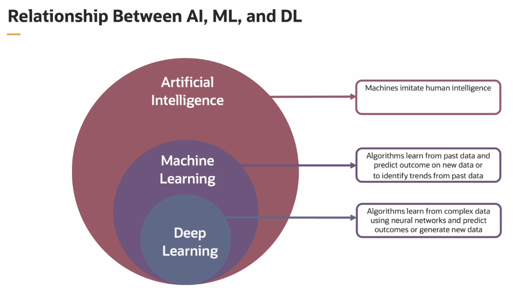
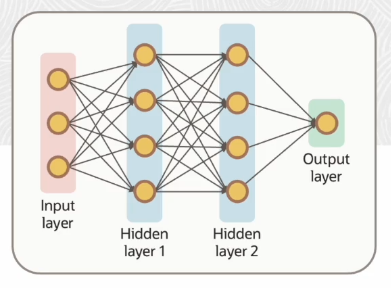

# AI vs ML vs DL

AI refers to the broader concept of creating machines or systems that can perform tasks that typically require human intelligence.

ML is a subset of AI that focuses on the development of algorithms that enable machines to learn from and make predictions or decisions based on data. An algorithm refers to a specific set of rules, mathematical equations, or procedures that the machine learning model follows to learn from data and make predictions on.

DL is a subfield of ML that uses **neural networks with many layers** (deep neural networks) to learn and make sense of complex patterns in data.

## Machine Learning

There are several types of Machine Learning.

- **Supervised Learning** *(extracting rules from data)*
    - the algorithm learns from **labeled data** making predictions or classification
- **Unsupervised learning** *(extracting trends from data)*
    - the algorithm discovers patterns and structures in **unlabeled data** such as clustering or dimensionality reduction
- **Reinforcement Learning** *(solving tasks by trial and error)*
    - the agents learn to make predictions and decisions by interacting with an environment and receiving rewards or punishments

## Supervised Machine Learning

Can we build rules by looking at past data ? We all learn by examples. Past data is nothing but a set of examples.

Through a process of **training**, a model can be built that will have a specific intelligence to do a specific task. The heart of training a model is an **algorithm** that incrementally updates the model by looking at the data samples one by one.

And once it's built, the model can be used to **predict** an outcome on a new data. 

## Unsupervised Machine Learning

Data does not have a specific outcome or a label as we know it. And sometimes, we want to discover **trends** that the data has for potential insights. Similar data can be grouped into **clusters**.

Exploring patterns and data and grouping similar data into clusters drives unsupervised machine learning. 

## Reinforcement Learning

How do we learn to play a game like chess? We'll make a move or a decision, check to see if it's the right move or feedback, and we'll keep the outcomes in your memory for the next step you take, which is learning. 

Reinforcement learning is a machine learning approach where a computer program learns to make decisions by trying different actions and receiving feedback. It teaches agents how to solve tasks by **trial and error**. 

This approach is used in autonomous car driving and robots as well.

## Deep Learning

Deep learning is all about extracting features and rules from data. 

Deep learning is a special kind of machine learning that trains super smart computer networks with lots of layers. These networks can learn things all by themselves from pictures, like figuring out if a picture is a cat or a dog.

## Neural Networks

Neural networks are made up of interconnected nodes or neurons in a layered structure that resembles the human brain. They are an example of a supervised machine learning algorithm that is perhaps the best understood in the context of **functional approximation**. 

Functional approximation involves estimating a hidden function by examining past or currently known data from the specific domain.

## Generative AI

Generative AI, is a subset of machine learning that creates diverse content like text, audio, images, and more. These models, often powered by neural networks, learn patterns from existing data to craft fresh and creative output.