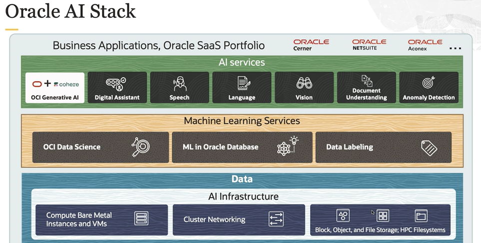

# AI Services

Oracle AI is this portfolio of cloud services for helping organizations take advantage of all data for the next generation of scenarios. The foundations of AI services and ML services layer is data.

OCI AI services is a collection of services with pre-built machine learning models that make it easier for developers to build a variety of business applications. The models can also be custom trained for more accurate business results.

The different services provided are:

- **digital assistant**: AI driven interfaces that help users accomplish a variety of tasks with natural language conversations
    - interact with the user
    - lists what it can do
    - routes user's request to skills
    - handles disambiguation

- **Language**: you can process unstructured text to extract insights without data science expertise
    - pretrained models
        - language detection
        - sentiment analysis
        - key phrase extraction
    - custom models (domain specific data sets)
        - named entity recognition
        - text classification
    - text translation
        - translate text across numerous languages

- **Vision**: you can upload images to detect and classify objects in them
    - pretrained models
        - object detection
        - image classification
        - optical character recognition
    - custom models
        - detecting the location of custom objects in an image and providing a bounding box
        - identify objects and scene based features in an image
- **Speech**: you can convert media files containing human speech into highly exact text transcriptions

- **Document Understanding**: you can upload documents to detect and classify text and objects in them
    - *OCR (Optical Character Recognition)*: can detect and recognize text in a document
    - *Text Extraction*: provides the word-level/line-level text and the bounding box (coordinates of where the text is found)
    - *Key Value Extraction*: extracts a predefined list of key value pairs of information from receipts, invoices, passports, etc.
    - *Table Extraction*: extracts content in tabular format, maintaining the row and column relationship of cells
    - *Classification*: classifies documents into different types
- **Anomaly Detection**: it is the identification of rare items, events, or observations in data that differ significantly from the expectation
    - analyzes large volume of multivariate or univariate time series data
    - designed to help with analyzing large amounts of data and identifying the anomalies at the earliest possible time with maximum accuracy

## Access Methods

OCI AI services provide multiple methods for access:

- OCI Console
    - provides easy to use browser-based interface
    - enable access to notebook sessions and all service features
- REST API
    - provides access to service functionality
    - requires programming expertise
- Language SDK 
    - provides programming language SDKs
- CLI
    - provides quick access and full functionality without the need for scripting