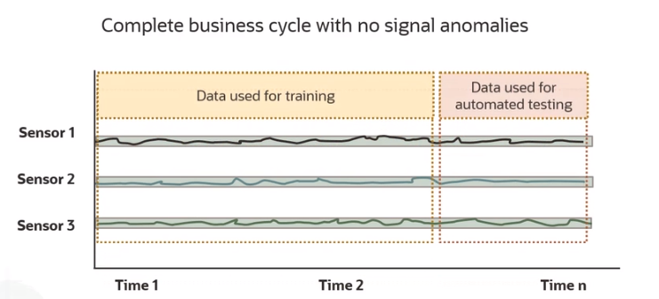
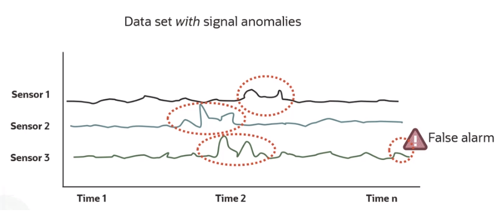
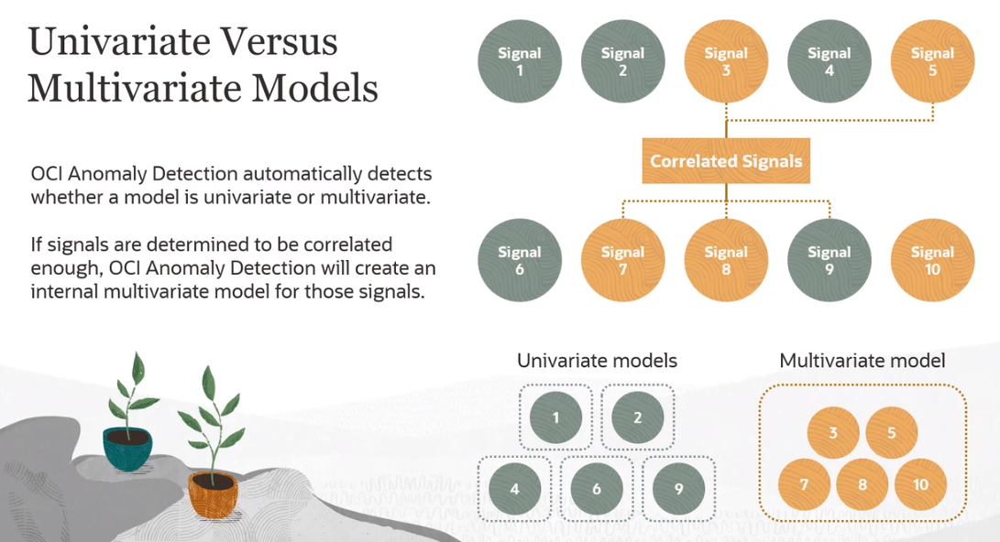

# Anomaly Detection

OCI Anomaly Detection identifies anomalies in time series data**. The unique feature of this service is that it finds anomalies, not just in a single signal, but across many signals at once. That's important because machines often generate multiple signals at once and the signals are often related.

The service contains algorithms for both multi-signal, as in multivariate, single signal, as in univariate anomaly detection, and it automatically determines which algorithm to use based on the training data provided. 

The multivariate algorithm is called MSET-2, which stands for Multivariate State Estimation technique, and it's unique to Oracle. The 2 in the name refers to the patented enhancements by Oracle labs that automatically identify and fix data quality issues resulting in fewer false alarms and more accurate results.

Unlike some of the other AI services, OCI anomaly detection is always trained on the customer's data. It's trained using actual historical data with no anomalies, and there can be as many different trained models as needed for different sets of signals.

One of the most obvious applications of this service is for **Predictive Maintenance**. Early warning of a problem provides the opportunity to deploy maintenance resources and schedule downtime to minimize disruption to the business.

Each trained model is accessible through a REST API and an HTTP endpoint. Additionally, programming language-specific SDKs are available for multiple languages, including Python. 

**Timestamps must follow the ISO 8601 format.

## How To Train an Anomaly Detection Model

1. Obtain training data

    The data must contain no anomalies and should cover the normal range of values that would be experienced in a full business cycle.

2. Upload training data to Object Storage

3. Create a data set fro the training data

4. Train the model
    
    Training a model requires a single data file with no anomalies that should cover a complete business cycle, which means it should represent all the normal variations in the signal. 
    
    
During training, OCI anomaly detection will use a portion of the data for training and another portion for automated testing. The fraction used for each is specified when the model is trained.

When model training is complete, it's best practice to do another test of the model with a data set containing anomalies to see if the anomalies are detected and if there are any false alarms. 

)

Based on the outcome, the user may want to retrain the model and specify a different False Alarm Probability (FAP). 

The FAP is the probability that the model would produce a false alarm. The false alarm probability can be thought of as the *sensitivity of the model*. The lower the false alarm probability, the less likelihood of it reporting a false alarm, but the less sensitive it will be to detecting anomalies. 

Selecting the right FAP is a business decision based on the need for sensitive detections balanced by the ability to tolerate false alarms.

Once a model has been trained and the user is satisfied with its detection performance, it can then be used for **inferencing**. 

## Univariate Models VS Multivariate Models

When training OCI anomaly detection models, the user does not need to specify whether the intended model is for multivariate or univariate data. It does this detection automatically. 

