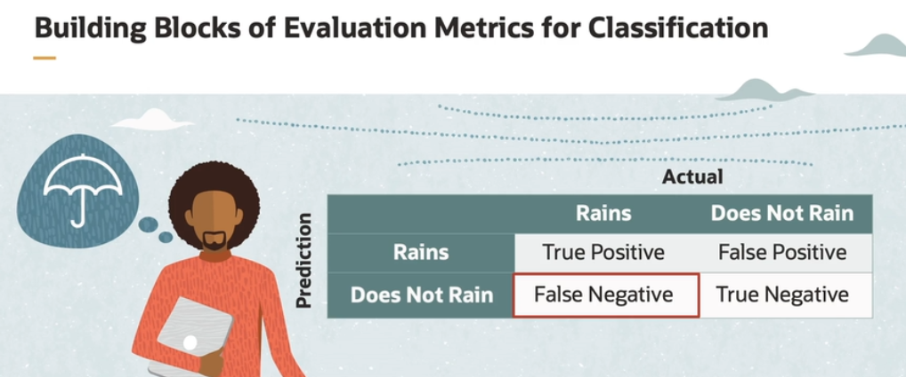
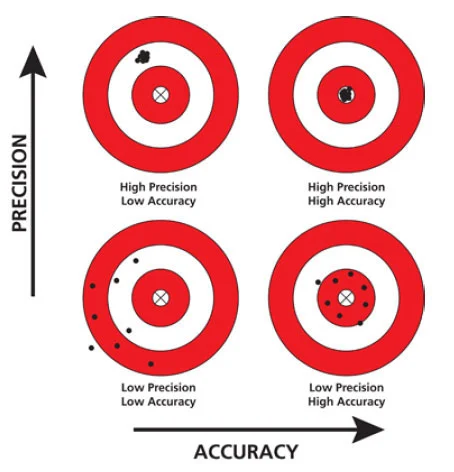

# Supervised Learning - Classification

Classification is a supervised machine learning technique used to categorize or assign data points into predefined classes or categories based on their features or attributes.

It is used for pattern recognition and predictive modeling. It works with labeled data sets and creates mapping between the input features and the output class labels, and is most suited for binary classification problems.

## Logistic Regression

Logistic regression predicts the output of a categorical dependent variable given the set of independent variables. It gives the output in the form of probabilities between 0 and 1.

Logistic regression uses a **Sigmodal Function** that helps modeling **Binary Classification Problems**. The sigmoidal function, often represented as the sigmoid function, has an S-shaped curve that maps any input value to an output value between 0 and 1.

But why do we need logistic regression instead of linear regression? Linear regression cannot be used to model when there are outliers in the data and the output needs to be in the range 0 to 1.

## Bulding blocks of Evaluation Metrics for Classification

The building blocks of evaluation metrics used in classification is also called **Confusion Matrix**.

Based on the four building blocks (true positive, true negative, false positive, false negative), we have three evaluation metrics:

- **accuracy** is the fraction of correct predictions (e.g. it is the ratio of correct predictions to the total number of predictions)

    *For class imbalanced data sets, accuracy alone is not sufficient as we have skewed class proportions. That means one or more classes in the data set may have significantly fewer examples compared to others.*

- **precision** is a measure of how accurately the system identifies positive cases

- **recall** computes the proportion of actual positives which was identified correctly. 

    *Recall helps us understand how well the system captures the positive cases without missing them. A higher recall value indicates that the system is better at identifying the positive cases.*

## Accuracy vs Precision

