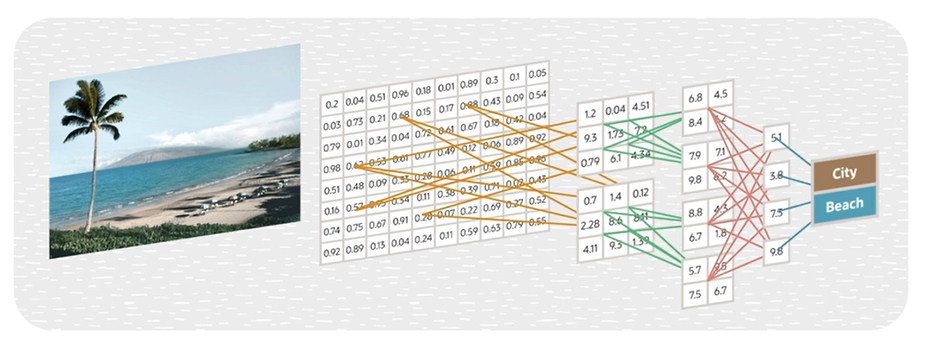

# DL Models - Convolutional Neural Networks

Convolutional Neural Network (CNN) is a type of deep learning model specifically designed for processing and analyzing **grid-like data**, such as images and videos. 

The role of the CNN is to reduce the image into a form, which is easier to process and without losing features, which are critical for getting a good prediction.

*In the ANN for handwritten characted recognition the input image is converted to a single dimensional array and given as an input to the network. But that does not work well with the image data because image data is inherently two dimensional. CNN works better with two dimensional data.*

## Limitations of CNN

CNNs do have some limitations:
- Computation: require massive data and computations
- Overfitting: happens with limited training data
- Interpretability: typical black-box model
- Sensitivity: highly sensitive to input variations

## Applications of CNN

- Image Classification
- Object Detection
    - The goal here is to draw bounding boxes around objects in an image.
- Image Segmentation
- Face Recognition
- Medical Imaging
- Autonomous Vehicles
- Remote Sensing
