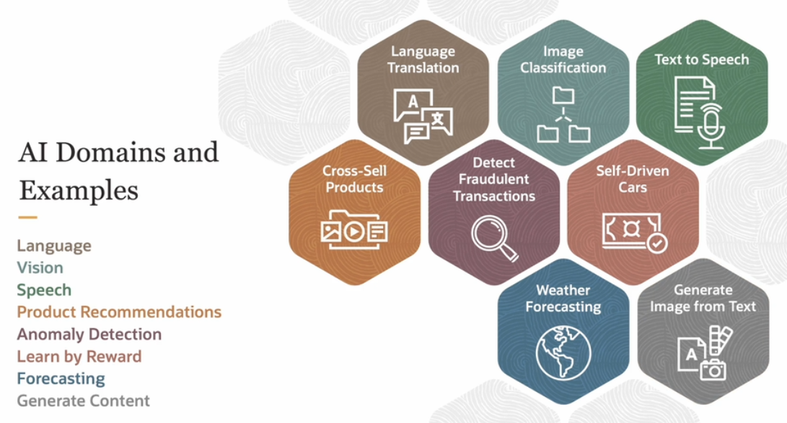

# Introduction to AI

AI is the ability of machines to imitate the cognitive abilities and problem solving capabilities of human intelligence.

Human Intelligence:
- learns new skills through observation
- thinks abstractly and reasons
- communicates using a language nonverbal cues
- handle complex situations in real time
- plans for short and long term
- creates art, music, inventions

If you can replicate any of these human capabilities in machines, this is **Artificial General Intelligence (AGI)**.

When we apply AGI to solve problems with specific and narrow objectives, we call it **Artificial intelligence (AI)**.

AI Examples:
- classifying images
- spam mail classification
- writing computer language code
- predicting old car prices

## Role of AI
    
AI is vital in today's world, and with the amount of data that's generated, **AI far exceeds the human ability to absorb, interpret, and actually make decisions based on that data**.

Why do we need AI ?

1. Automation and Decision Making
    - Approve a credit card loan
    - Process insurance claim
    - Recommend products to customers
    - Detect fraudolent transactions
    - Classify documents and images

2. Creative Support
    - Create content
    - Write stories and poem
    - Provide design
    - Share code
    - Generate ideas
    - Crack jokes

## AI Domains and Examples

