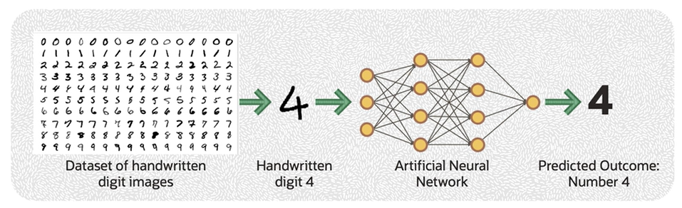
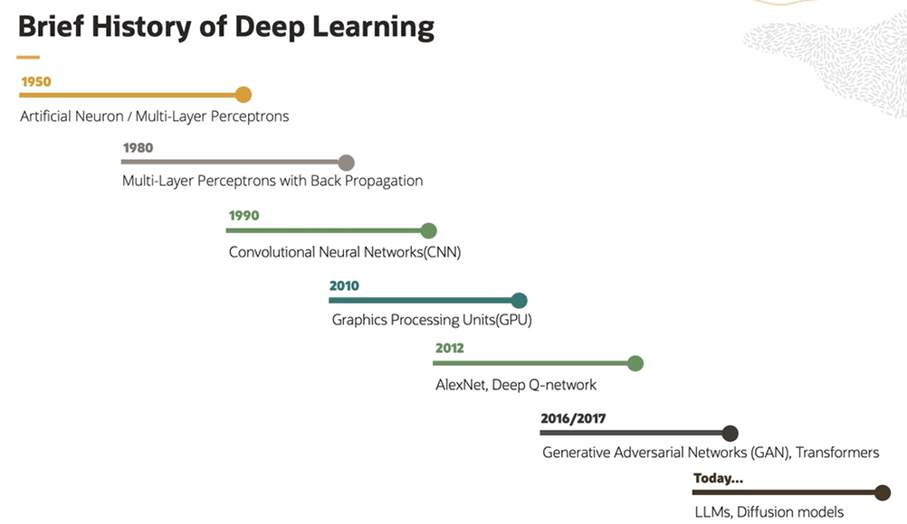
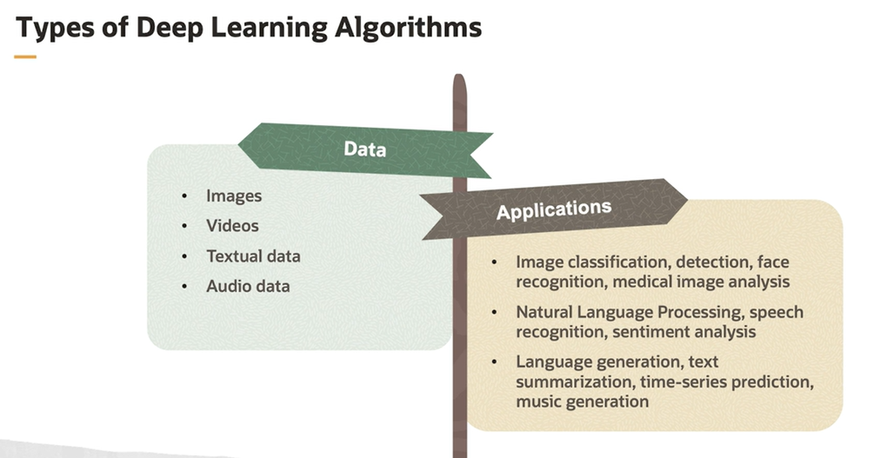
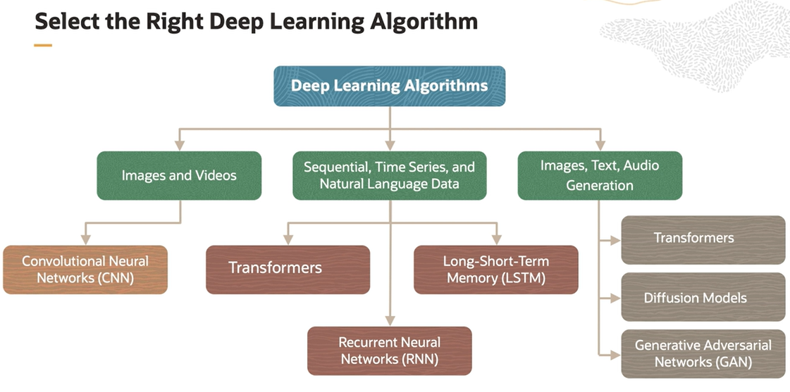
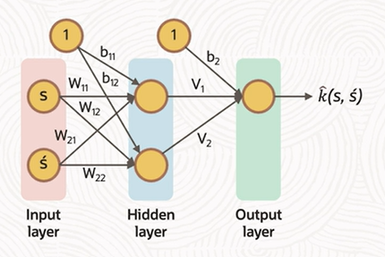
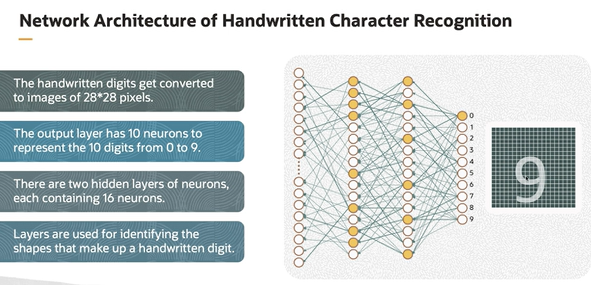

# Introduction to DL

Deep Learning is a subset of machine learning that focuses on training Artificial Neural Networks (ANNs) to solve a task at hand. 

A very important quality of the ANN is that it can process raw data like pixels of an image and extract patterns from it. These patterns are treated as features to predict the outcomes.

ANN accepts image pixels as inputs, extract patterns like edges and curves and so on, and correlates these patterns to predict an outcome. 

## Why do we need Deep Learning

1. ML needs us to specify features
2. DL extracts features from raw and complex data
3. Internal representation of data is built using extracted features (this may not be feasible manually!)
4. DL algorithms can make use of parallel computations (data is split into small batches and process parallelly)
5. This leads to scalability and performance

In short, Deep Learning complements machine learning algorithms for complex data for which features cannot be described easily.

## History of DL

## Types of DL 

## Artificial Neural Networks (ANNs)

Artificial Neural Networks (ANNs) are inspired by the human brain. They are made up of interconnected nodes called as neurons.

In ANN, we assign weights to the connection between neurons. Weighted inputs are added up. If the sum crosses a specified threshold, the neuron is fired and the outputs of a layer of neuron become an input to an another layer.

ANN Building Blocks:

- **Layers**: input, hidden, output layers receive inputs, transform it, and produce outputx
- **Neurons**: computational units which accepts an input and produce an output
- **Weights**: determines the strength of connection between neurons (the connection could be between input and a neuron, or it could be between a neuron and another neuron)
- **Activation Function**: works on weighted sum of inputs to a neuron and produces an output
- **Bias**: additional input to a neuron that allows certain degree of flexibility

*Hidden layers in neural networks are crucial for character recognition because they enable the network to learn and extract complex features and patterns, such as edges, shapes, and curves, which are essential for recognizing characters.*

*A neuron in an Artificial Neural Network is the fundamental building block responsible for performing weighted summation and applying an activation function to input data to produce an output.*

## How are ANNs trained ?

During training, we show an image to the ANN. Let us say it is an image of digit 2. So we expect output neuron for digit 2 to fire. But in real, let us say output neuron of a digit 6 fired. So what do we do? We know that there is an error. So to correct an error, we adjust the weights of the connection between neurons based on a calculation, which we call as **Backpropagation Algorithm**. By showing thousands of images and adjusting the weights iteratively, ANN is able to predict correct outcome for most of the input images. 

This process of adjusting weights through backpropagation is called as **model training**. 

Backpropagation Algorithm:

1. Guess and compare
2. Measure the error
3. Adjust the guess
4. Update the weight
