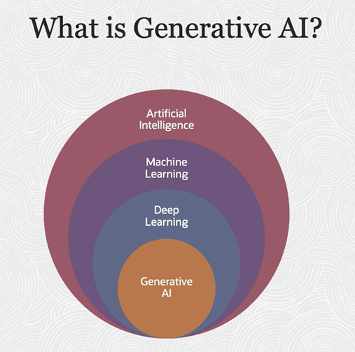
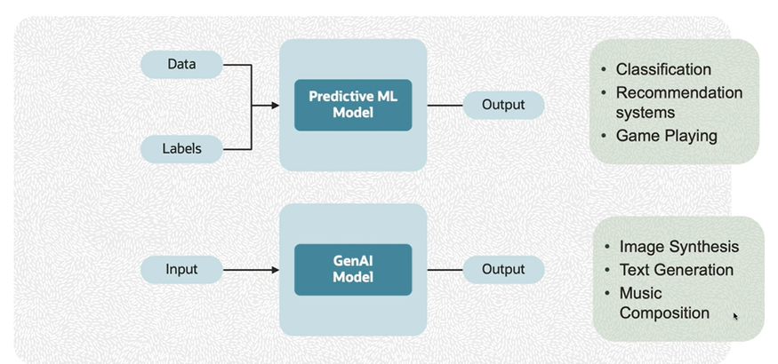
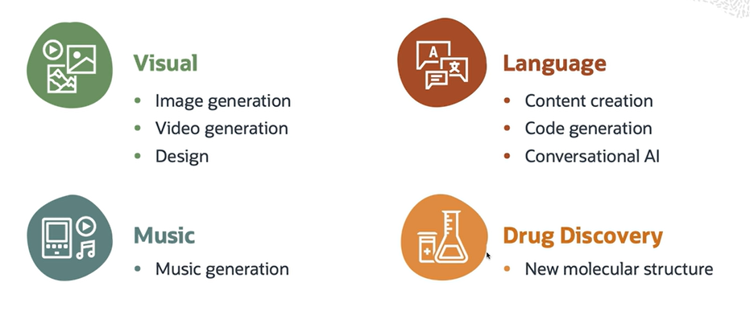

# Introduction to Generative AI

Generative AI refers to a type of AI that can create new content. It is a subset of Deep Learning, where the models are trained not to make predictions but rather to generate output on their own.

Generative models can create a wide range of outputs, such as images, music, speech, text, or other types of data.

Think of Generative AI as an artist who looks at a lot of paintings and learns the patterns and styles present in them. Once it has learned these patterns, it can generate new paintings that resembles what it learned.

It is important to note that generative models are not truly creative or understanding humans as they rely on patterns in the data they were trained on and don't have emotions or personal experiences.

*Generative AI is focused on creating new content or data rather than making predictions based on existing training data. It involves generating novel and meaningful outputs such as images, text, music, or other forms of creative content.*

## How does generative AI works ?

To explain this in a simple way, let's imagine you are trying to teach a generative AI model to draw a dog.

You would start by giving it a lot of pictures of dogs to learn from. The AI does not know anything about what a dog looks like. But by looking at these pictures, it starts to figure out common patterns and features, like dogs often have pointy ears, narrow faces, whiskers, et cetera. You can then ask it to draw a new picture of a dog.

The AI will use the patterns it learned to generate a picture that hopefully looks like a dog. But remember, the AI is not copying any of the pictures it has seen before but creating a new image based on the patterns it has learned. In practice the process involves a lot of complex maths and computation. 

There are different techniques and architectures that can be used, such as:
- Variational Autoencoders (VAs)
- Generative Adversarial Networks (GANs)

## Generative AI is different from other AI approaches

AI approaches like supervised learning or reinforcement learning are typically used for tasks, like classification, recommendation systems, and game playing, where focus is on decision making and optimization.

Generative AI model aims to understand the structure of data and learn how to generate similar samples.

## Types of Generative AI Models
- Image-Based
    - Generates visual contents
    - learn from large collections of image data
- Text-Based
    - Generates textual contents
    - Learns from large collections of text data

## Generative Adversarial Data (GAN)

Generative Adversarial Network (GAN) is widely used for image generation tasks.

## Transformers and Large Language Models (LLM)

Transformers and Large Language Models (LLM) are very good example for a text based generative model. 

They are built to understand generate and process human language at a massive scale. These models are typically based on deep learning architectures, such as transformers, and are trained on vast amount of text data to learn language patterns and relationships.

## Generative AI Real-Wold Use Cases

For the image generation, generative models like GANs are used to generate realistic images. Again, they can be used for tasks, like creating artwork, synthesizing images of human faces, or transforming sketches into photorealistic images.

For text generation, large language models like GPT 3, which are generative in nature, can create human like text. This has applications in content creation, like writing articles, generating ideas. And again, conversational AI, like chat bots, customer service agents. They are also used in programmings for code generation and debugging, and much more. 

For music generation, generative AI models can also be used. They create new pieces of music after being trained on a specific style or collection of tunes. A famous example is OpenAI's musenet.

Generative AI is also used in pharmaceutical industry for drug discovery, which can propose novel molecular structures for potential new drugs, significantly speeding up the early stages of drug discovery.

