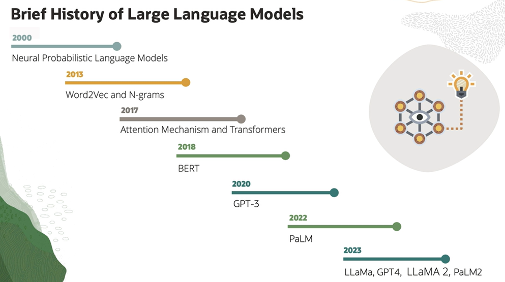
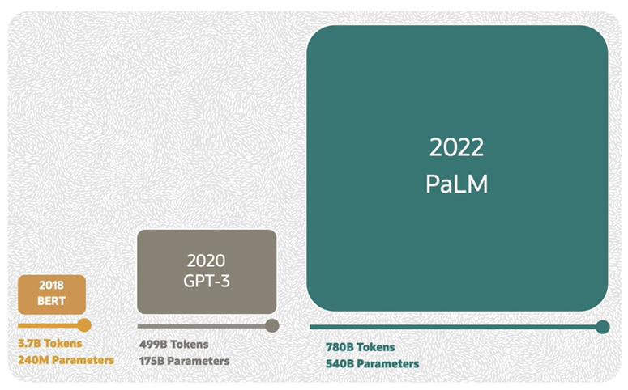

# Introduction to Large Language Models (LLM)

Large Language Models (LLMs) are a type of artificial intelligence models built to understand, generate, and process human language at a massive scale. 

They were primarily designed for sequence to sequence tasks such as machine translation, where an input sequence is transformed into an output sequence.

## LLM Features

- Based on deep learning architectures such as transformers
- Trained on vast amount of text data to learn language patterns and relationships
- Massive number of parameters usually in order of millions or even billions
- Ability to comprehend and understand natural language text at a semantic level (they can grasp context, infer meaning, and identify relationships between words and phrases)
- Remarkable capabilities in natural language understanding and generation
- Perform very well in various NLP tasks such as:
    - sentiment analysis
    - question and answering
    - language translation
    - summarization
    - named entity recognition

## History of LLMs

## Model Size and Parameters

**Model size and parameters are crucial aspects of large language models and other deep learning models. They significantly impact the models capabilities, performance, and resource requirements.

The **model size** refers to the amount of memory required to store the model's parameter and other data structures. Larger model sizes generally led to better performance as they can capture more complex patterns and representation from the data.

The **parameters** are the numerical values of the model that change as it learns to minimize the model's error on the given task. In the context of LLMs, parameters refer to the weights and biases of the model's transformer layers.

*Parameters are usually measured in terms of millions or billions. For example, GPT-3, one of the largest LLMs to date, has 175 billion parameters making it extremely powerful in language understanding and generation.*

The **tokens** represent the individual units into which a piece of text is divided during the processing by the model. In natural language, tokens are usually words, subwords, or characters. Some models have a maximum token limit that they can process and longer text can may require truncation or splitting. 

Balancing model size, parameters, and token handling is crucial when working with LLMs. 

*The size and complexity of a language model, including the number of parameters (weights) and tokens have a profound impact on its capabilities and performance. Larger models with more parameters tend to have a better understanding of language and can generate more coherent and contextually relevant text. Larger models, however, require substantial computational resources, including GPUs and memory, for both training and inference.*

## Bigger models are NOT always better!

1. Model size and numbers of tokens should be scaled equally
2. Scaling to larger data sets only beneficial when data is high-quality
3. Difficult to expand data set size by a large degree
4. Focus must be on high-quality data, though larger models perform better

## Applications of LLMs

1. Text Classification
    - Spam Detection
    - Sentiment Analysis
    - Content Categorization
2. Question Answering
    - Q&A Systems
    - Chatbots
3. Text Generation
    - Language Translation
    - Text Summarization
4. Document Summarization
    - Extracting Key Information

