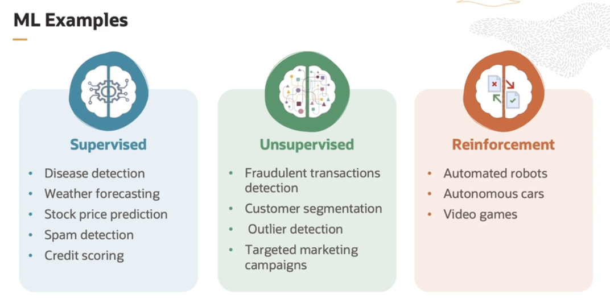

# Introduction to ML

Machine Learning is a subset of artificial intelligence that focuses on creating computer systems that can learn and improve from experience without being explicitly programmed.

It is powered by algorithms that incorporate intelligence into the machines by automatically learning from the data it consumes.

Machine first learns to identify the objects, and once it succeeds, it can be used to make predictions.

ML application examples:
- online shopping
- movie/video suggestions
- spam mail warning
- self-driving car

## ML Model

In machine learning, the term **model training** is used to build an ML model. During the process of model training, a relationship is established between the input features and output parameters. 

    y = f(x)

Feature **x** are relevant information from the available data selected to train the model. The output label **y** represents the information or prediction that the model aims to generate based on the input features.

The goal is to **approximate the mapping function** so well that when you have new input data x, you can predict the output variable y for that data.

## Data Types

Depending on the type of data, this might have some effect on the type of algorithm that you can use for modeling or the type of questions you can ask of it. 

ML models rely broadly on four primary data types:

- **numeric or quantitative data** (measurable data)

- **categorical data** (characteristics)
    - nominal *(e.g. red, blue, white)*
    - ordinal *(e.g. easy, medium, hard)*

- **time series data** (number sequence)
    - a sequence of numbers collected at regular intervals over a period *(e.g. number of book sales over a year)*

- **text data** (words or paragraphs)

## Flavors of Machine Learning

Machine learning is an **algorithm-driven approach** to create a model. The types of machine learning models depend on whether we have a labeled output or not. 

There are, in general, three types of machine learning approaches:
- supervised
    - used to classify data or make predictions
- unsupervised
    - used to understand relationships within data sets
- reinforcement
    - used to make decisions or choices
    

## When is ML not the optimal solution ?

While ML provides a good solution for cases where the problem statement is simple and huge labeled data is available, there are places where ML is not a good solution:
- simpler alternatives
- insufficient data
- high costs
- complex data handling
- scalability 

## Standardization in ML

Standardization is the process of transforming data so that it has mean of 0 and a standard deviation of 1. 

It's important in machine learning because it ensures that all features or variables are on the same scale preventing some features from dominating the learning process due to their largest magnitude.

For example, let's say you are building a machine learning model to predict house prices, and you have two features: square footage and number of bedrooms. The square footage values ranges from 1.000 to 5.000 square feet while the number of bedrooms ranges from 1 to 6. So, in case if you don't standardize these features, the model might give more weight to a square footage because it has larger values. And this could result in an inaccurate model as the number of bedrooms might also be a significant predictor. So the standardization scales both those features to have comparable means and standard deviation and hence, allowing the model to treat them equally. 