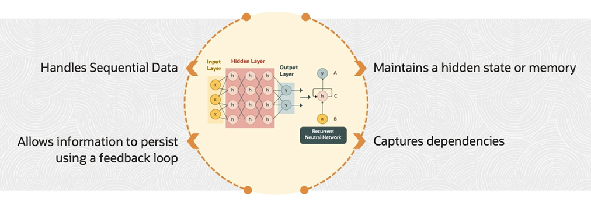
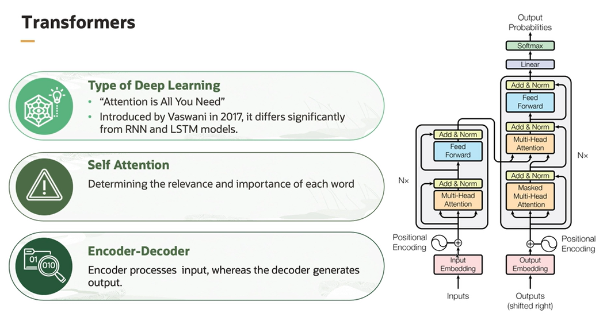

# LLM and Transformer Model

Understanding language is difficult for computers and AI systems. The reason being the attributes often have meanings based on context.

**Sequence Models** are used to solve problems, where the input data is in form of sequences that is ordered lists of data points or events. The goal in sequence problems is to find patterns dependencies or relationships within the data and make predictions, classification, or generate new sequences based on that understanding.

Common example of sequence models includes:
- Natural Language Processing (NLP)
- Speech Recognition
- Music Generation
- Gesture Recognition
- Time Series Analysis

## Recurrent Neural Networks (RNNs)

**Recurrent Neural Networks (RNNs)** are a class of neural network architectures specifically designed to handle sequential data. 

Unlike traditional feed forward neural networks, which is unidirectional and only goes from input to output, RNNs have a feedback loop that allows information to persist across different time steps, making them well-suited for tasks involving sequences of data.

The key feature of RNN is their ability to maintain an internal state, often referred to as the **hidden state or memory**, which is updated as the network processes each element in the sequence. This hidden state is then used as input to the network for the next time step, allowing the model to capture dependencies and patterns in the data that are spread across time. 

## Transformers

Sequential models, such as RNNs and LSTM process input data one element at a time, maintaining a hidden state that summarizes the previous elements information. While this works well for short sequences, it becomes problematic when dealing with long sentences or documents. 

As the sequence grows, the model's ability to retain relevant context and dependencies weakens, leading to a phenomena called **vanishing gradient**. Consequently, long range dependencies becomes challenging to capture, limiting the model's understanding of the entire sequence.

So what is the solution? The solution is **transformers**. 

It's like model has a bird's eye view of the entire sentence and can see how all the words relate to each other. This allows it to understand the sentence as a whole instead of just a series of individual words. Transformers with their **self-attention mechanism** can look at all the words in the sentence at the same time and understand how they relate to each other.

Transformer is a type of deep learning model that was introduced, again, in the paper [Attention Is All You Need](https://arxiv.org/abs/1706.03762), in 2017. And it differs significantly from RNN and LSTM models.

Through self-attention, it allows each word in the input sequence to attend to all other words, determining the relevance and importance of each word concerning the entire sequence. It has encoded decoder architecture, where encoded processes the input sequence, whereas the decoder generates the output sequence. 

