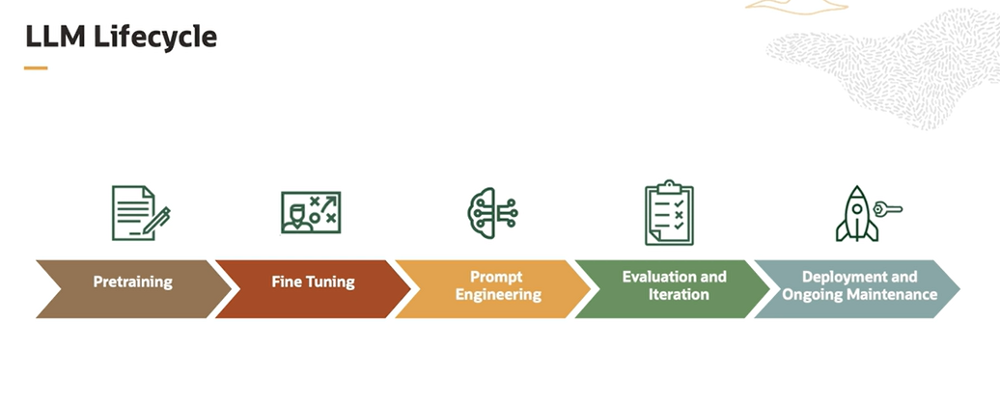

# LLM Fine Tuning

Tthe life cycle of a Large Language Model involves several stages:

- **Pre-training**
    - the model learns grammar, facts, reasoning abilities, and general language understanding
    - the model predicts the next word in a sentence given the previous words, which helps it capture relationships between words and the structure of language
- **Fine Tuning**
    - the model's weights are initialized
    - fine tuning can involve supervised learning on labeled data for specific tasks, such as sentiment analysis, translation, or text generation
    - the model is fine tuned on specific tasks using a smaller domain specific data set
    - the weights from pre-training are updated based on the new data
- **Prompt Engineering**
    - this phase craft effective prompts to guide the model's behavior in generating specific responses
    - different prompt formulations, instructions, or context can be used to shape the output
- **Evaluation and Iteration**
    - models are evaluated using various metrics to access their performance on specific tasks
    - iterative refinement involves adjusting model parameters, prompts, and fine tuning strategies to improve results
    - you also do few shot and one shot inference
    - if needed, you further fine tune the model with a small number of examples
    - **bias mitigation** and consider the **ethical concerns** (you need to implement measures to ensure fairness in inclusivity and responsible use)
- **Deployment and Ongoing Maintenance**
    - deployed models can perform tasks, such as text generation, translation, summarization, and much more
    - you also perform monitoring and maintenance
    - you continuously monitor the model's performance and output to ensure it aligns with desired outcomes
    - you also periodically update and retrain the model to incorporate new data and to adapt to evolving language patterns

This overall life cycle can also consist of a feedback loop, whether you gather feedbacks from users and incorporate it into the models improvement process. RLHF, which is Reinforcement Learning with Human Feedback, is a very good example of this feedback loop.

You also research and innovate as a part of this life cycle, where you continue to research and develop new techniques to enhance the model capability and address different challenges associated with it.

## Fine Tuning

In the context of LLM, fine tuning refers to the process of further training a pre-trained language model on a specific task or domain to make it more specialized and accurate for that particular use case.

Fine tuning is required for:
- task specific adaptation
- domain specific vocabulary
- efficiency and resource utilization
- ethical concerns

Fine tuning reuses the knowledge from pre-trained models saving time and resources. Again, fine tuning requires fewer iterations to achieve task specific competence. Shorter training cycles expedite the model development process. And again, it conserves computational resources, such as GPU memory and processing power. 

Pre-trained models learns from diverse data and those potentially inherit different biases. So fine tune might not completely eliminate biases but careful curation of task specific data ensures avoiding biased or harmful vocabulary. 