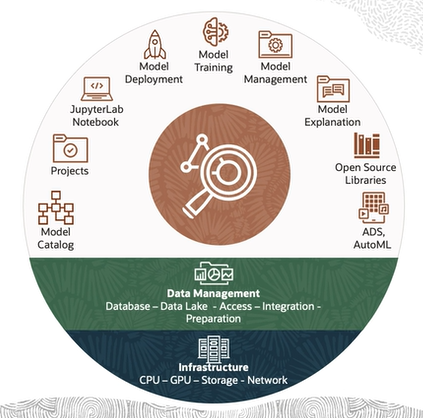
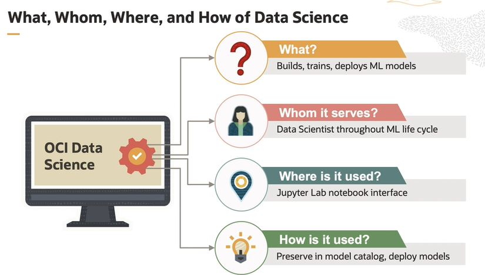

# ML Services

OCI Data Science is the cloud service focused on serving the data scientist throughout the full machine learning life cycle with support for Python and open source.

Oracle Database's Machine Learning capabilities are designed to eliminate the need to move data out of the database for Machine Learning tasks. This is a significant advantage because it reduces data latency, enhances security, and simplifies the overall architecture of data-driven applications. By providing in-database Machine Learning, Oracle empowers users to perform Machine Learning tasks directly within the database, leveraging its computational power and efficiency.

## CORE Principles

There are three core principles of OCI Data Science:

- **Accelerated**. The first principle is about accelerating the work of the individual data scientist. OCI Data Science provides data scientists with open source libraries along with easy access to a range of compute power without having to manage any infrastructure. It also includes Oracle's own library to help streamline many aspects of their work.

- **Collaborative**. It goes beyond an individual data scientists productivity to enable data science teams to work together. This is done through the sharing of assets, reducing duplicative work, and putting reproducibility and auditability of models for collaboration and risk management. Third is enterprise grade. 

- **Enterprise grade**. That means it's integrated with all the OCI Security and access protocols. The underlying infrastructure is fully managed. The customer does not have to think about provisioning compute and storage and the service handles all the maintenance, patching, and upgrades so user can focus on solving business problems with data science. 

## What, Whom, Where ad How of Data Science

## Features and Terminology

- **Projects**. The projects are containers that enable data science teams to organize their work. They represent collaborative work spaces for organizing and documenting data science assets, such as notebooks sessions and models.

- **Notebook Sessions**. Notebook sessions provide a JupyterLab environment with pre-installed open source libraries and the ability to add others. Notebook sessions are interactive coding environment for building and training models.

- **Conda Environment**. It's an open source environment and package management system and was created for Python programs. It is used in the service to quickly install, run, and update packages and their dependencies. Conda easily creates and switches between environments in your notebooks sessions. 

- **Accelerated Data Science (ADS) SDK**. Oracle's Accelerated Data Science ADS SDK is a Python library that is included as part of data science. ADS has many functions and objects that automate or simplify the steps in the data science workflow, including connecting to data, exploring, and visualizing data. 

- **Models**. Models define a mathematical representation of your data and business process. You create models in notebooks, sessions, inside projects. 

- **Model Catalog**. The model catalog is a place to store, track, share, and manage models. The model catalog is a centralized and managed repository of model artifacts. A stored model includes metadata about the provenance of the model, including Git related information and the script. Models stored in the model catalog can be shared across members of a team, and they can be loaded back into a notebook session. 

- **Model Deployments**. Model deployments allow you to deploy models stored in the model catalog as HTTP endpoints on managed infrastructure. Deploying machine learning models as web applications, HTTP API endpoints, serving predictions in real time is the most common way to operationalize models. HTTP endpoints or the API endpoints are flexible and can serve requests for the model predictions. 

- **Jobs**. Jobs enable you to define and run a repeatable machine learning tasks on fully managed infrastructure.