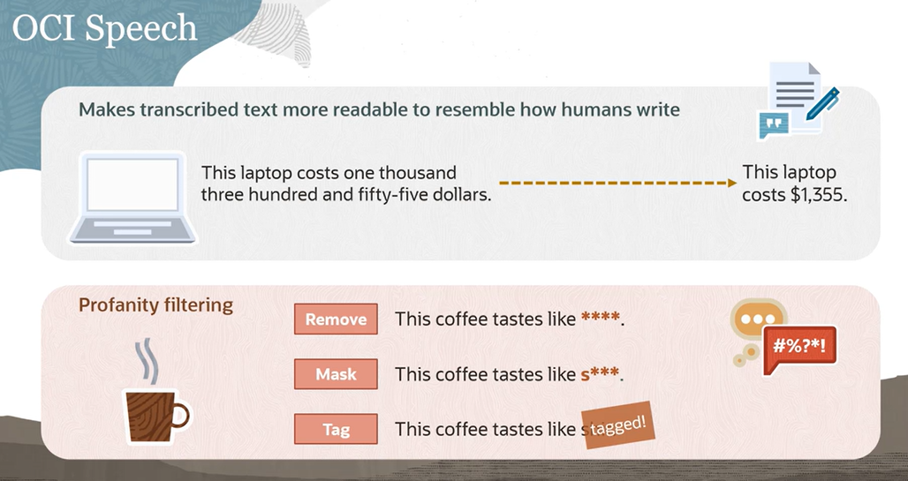

# OCI Speech

OCI Speech main capabilities:

- it transcribes audio and video files into text using advanced deep learning techniques
- no data science experience required
- it processes data directly in object storage
- it generates timestamped, grammatically accurate transcriptions

OCI Speech features:

- itsupports multiple languages
- it has batching support where multiple files can be submitted with a single call
- it has blazing fast processing.

    *it can transcribe hours of audio in less than 10 minutes by chunking up your audio into smaller segments, and transcribing each segment, and then joining them all back together into a single file*
- it provides a confidence score, both per word and per transcription
- it punctuates transcriptions to make the text more readable and to allow downstream systems to process the text with less friction
- it has SRT file support 

    *SRT is the most popular closed caption output file format and with this SRT support, users can add closed captions to their video*
    
