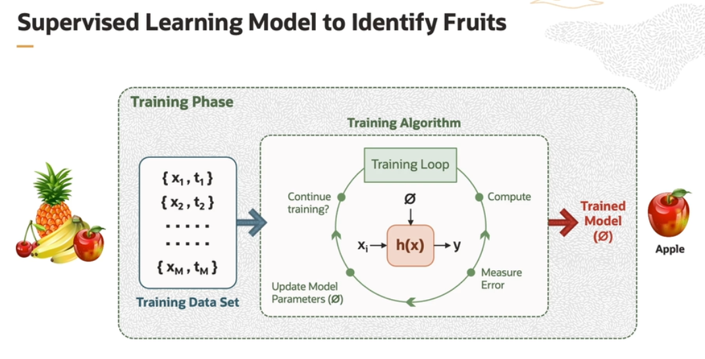
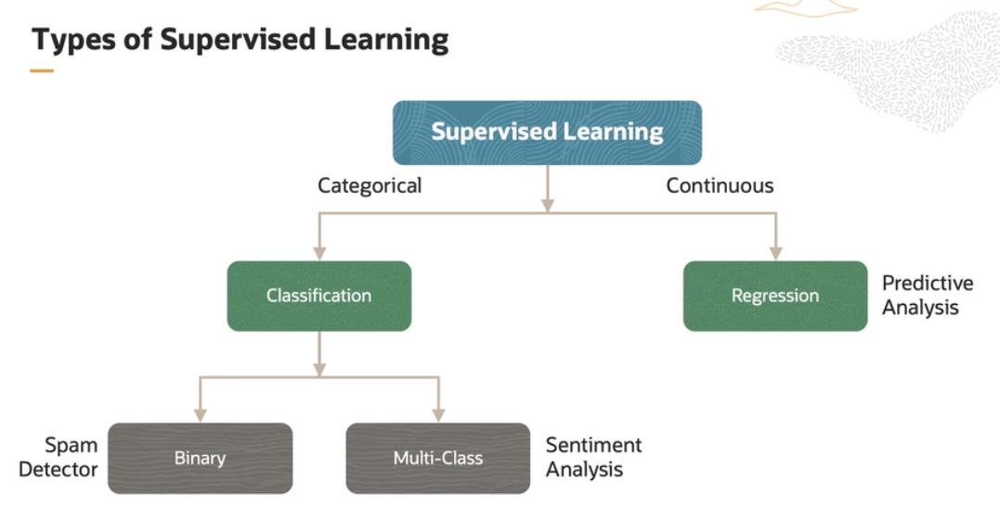
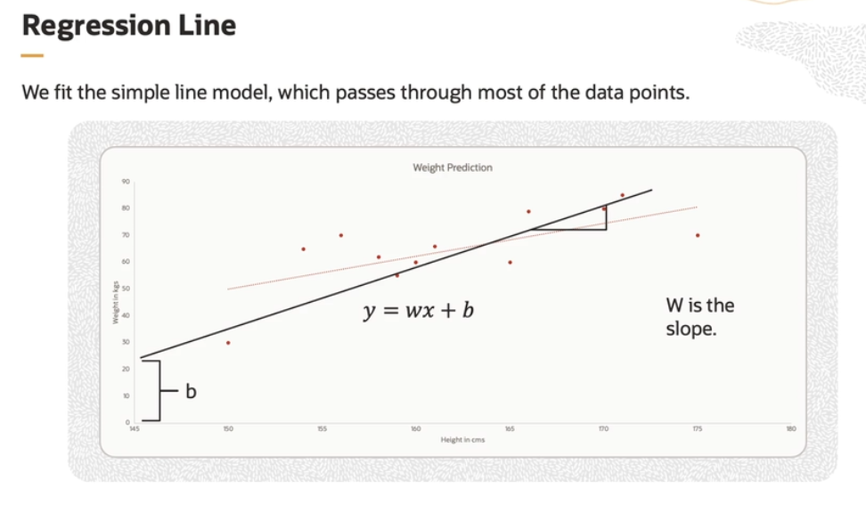
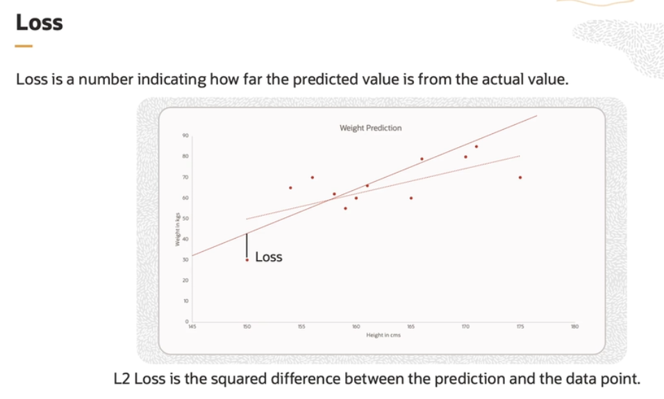
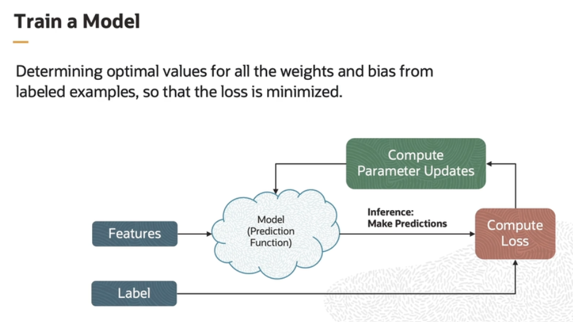

# Supervised Learning - Regression

Supervised machine learning is a machine learning model which learns from labeled data. The model learns the mapping between the input and the output. Supervised machine learning is generally used to classify data or make predictions.

Supervised Learning application examples:
- spam detection 
    - output is binary
- disease detection
    - output is binary
- sentiment analysis
    - output is multi-class
- stock price prediction 
    - output is continuous and quantitative

## Example

The inputs to a supervised learning model is the input/output pair. In the figure **x** is the input feature and t is the target. If we want a model to identify fruits, the training inputs would be the features of the fruits, like color, size, and shape, and the output would be the fruit label **t** which can be apple, banana, and so on.

A model is built using these features and the relationship between the features and class labels are established. The training algorithm iteratively trains the models. During training, the model learns the mapping between the input and output. This mapping is the hypothesis. The correctness of the hypothesis is measured, and an error is compared for the training data set. Based on the error, the hypothesis parameters are fine tuned. This loop iteratively continues till the error becomes very small.

The output of the training algorithm is the trained model, which does the prediction. The accuracy of prediction depends on how well the model is trained. The model is trained with a training data set, in this case, various fruits. For instance, if the shape of the object is round and has a depression at the top, and is red in color, then it will be labeled as apple. 

## Steps in Supervised Learning

1. **Data Access**

    Labeled data, as per the requirement of the application, is first collected. This data set should represent the problem to be solved.

2. **Data Preparation**

    This is the data pre-processing step, where data is cleaned by removing missing values, outliers, scaling features, and encoding categorical values. The data gets prepared for training.

3. **Modeling**

    In modeling, we split the data as training and testing data. Appropriate machine learning algorithm is selected and applied, as per the requirement. The model is then trained, where the model learns the mapping between the input features and output labels, or values. 
    
4. **Validation**

     Validation helps to identify potential issues, like *overfitting* (when the model memorizes the training data, but fails to generalize well) or *underfitting* (when the model is too simple and cannot capture the underlying patterns in the data).

5. **Deployment**

    Once the model is trained and evaluated, it is deployed and used for prediction.

6. **Monitoring and Iteration**

    Iteratively monitor the model performance and ensure the prediction is accurate with unseen data.

## Types of Supervised Learning

In supervised machine learning, the output can be either:
- categorical (classification problem)
- continuous (regression problem)

## Regression

Regression is a supervised machine learning technique which is used to predict continuous values based on input data. In contrast to classification, where the goal is to assign data points to discrete classes or categories, regression aims to estimate a continuous output.

Linear regression is the simplest form of regression, where the relationship between the variables is assumed to be linear, represented as a straight line. It aims to find the best-fitting line that **minimizes the sum of squared errors** between the predictor value and the actual target values.

The variable you want to predict is called the dependent variable. The variable you are using to predict the dependent variable's value is called the independent variable. For every data point, the difference between the actual and the predicted value is the loss, or error.

In the example of predicting weight for a given height, based on the existing data points, we can arrive at multiple lines, which can pass through most of the data points. The model picks up the most suitable regression line having the minimum loss. The loss function is called **L2 loss**. It is the square of the difference between a single data point and its predicted value.

Basically, loss is a penalty for a bad prediction. If the model's prediction is perfect, the loss is 0. Otherwise, the loss is high. L2 loss is to be minimized during training throughout the entire data set.

Training is a good way to reduce the model's loss, and it is done iteratively. The input features are used to calculate the output label using the relationship represented by the linear regression model. The predicted outputs are compared with the label, and the losses generated. The loss is used in computing the parameter updates. With the computed parameters, the model prediction function is run again. 

The correctness of the linear model can be evaluated by different evaluation metrics:

- **Mean Absolute Error** is a very simple metric which calculates the absolute difference between the actual and predicted values

- **Mean Squared Error (MSE)** finds the squared difference between the actual and predicted value. The impact of the error is lesser when root mean squared error is used

- **R-squared** evaluates the performance of the model, but not in terms of loss. It is like a threshold matrix, also called **coefficient of determination** or **goodness of fit**. The r value, computed, lies in the range of 0 to 1, where 1 indicates a perfect fit and 0 indicates a worse fit.