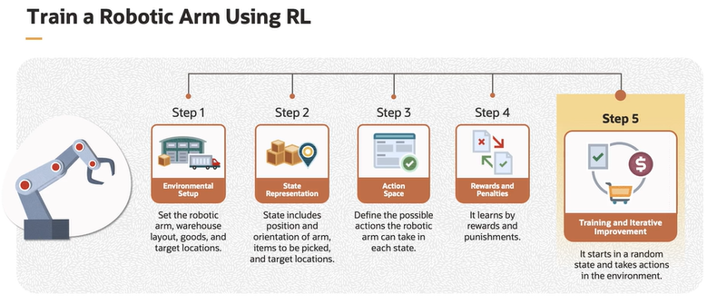

# Reinforcement Learning

**Reinforcement Learning** is a type of Machine Learning that enables an agent to learn from its interaction with the environment, while receiving feedback in the form of rewards or penalties without any labeled data.

*Reinforcement Learning is like teaching a dog new tricks: you reward it when it does something right, and over time, it learns to perform these actions to get more rewards.*

## Use Cases

- Autonomous vehicles
- Smart devices
- Industrial automation
- Gaming and entertainment

## Terminology in RL

1. **Agent**: interacts with environment, takes actions, learns from feedback

2. **Environment**: external system with which the agent interacts

3. **State**: representation of the current situation of the environment at a particular time 

4. **Action**: possible moves or decisions that the agent can take in each state

5. **Policy**: mapping that the agent uses to decide which action to take in a given state

The goal of reinforcement learning algorithm is to find a policy that will yield a lot of rewards for the agent if the agent follows that policy referred to as the optimal policy.

Through a process of learning from experiences and feedback, the agent becomes more proficient at making good decisions and accomplishing tasks. This process continues until eventually we end up with the optimal policy. The optimal policy is learned through training by using algorithms like **Deep Q Learning** or **Q Learning**.

