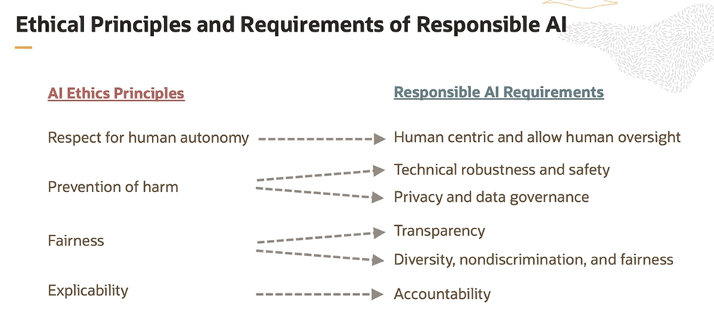

# Responsible AI

The guiding principles for AI to be trustworthy are:
- **AI should be lawful**, complying with all applicable laws and regulations
- **AI should be ethical**, that is it should ensure adherence to ethical principles and values that we uphold as humans
- **AI should be robust**, both from a technical and social perspective because even with the good intentions, AI systems can cause unintentional harm

## AI Ethics Principles

1. Respect for human autonomy
2. Prevention of harm
3. Fairness
4. Explicability

AI that follows the ethics principles is **Responsible AI**.

## Responsible AI Cycle and Roles

