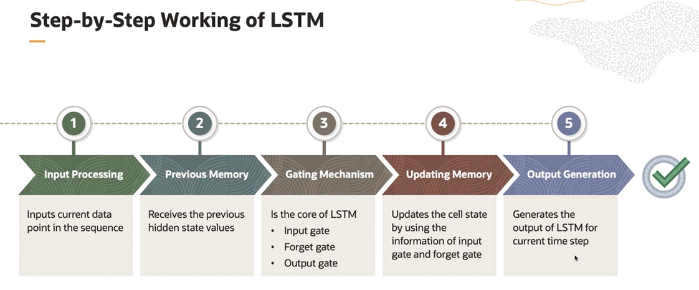

# DL Models - Sequence Models

Sequence Models are used to solve problems where the input data is in the form of sequences. The sequences are ordered lists of data points or events.

The goal in sequence models is to find patterns and dependencies within the data and make predictions, classifications, or even generate new sequences.

Common examples of the sequence models:
- Natural Language Processing
    - Machine translation
    - Sentiment analysis
    - Text generation
- Speech Recognition
    - Convert a recorded audio into text
- Music Generation
    - Generate new music or create original compositions
- Gesture Recognition
    - Sign language recognition
- Time Series Analysis
    - Predict future values

*Sequence models are indeed well-suited for tasks involving sequentially ordered data points or events, such as time series analysis, natural language processing, speech recognition, and language translation. However, for image classification and object recognition, traditional machine learning models and convolutional neural networks (CNNs) are more commonly used.*

## Recurrent Neural Networks (RNNs)

Recurrent Neural Networks (RNNs) are a class of neural network architectures specifically designed to handle sequential data. Unlike traditional feedforward neural network, RNNs have a **feedback loop** that allows information to persist across different timesteps. 

The key features of RNN is their ability to maintain an internal state often referred to as a **hidden state** or **memory**, which is updated as the network processes each element in the input sequence. 

The hidden state is then used as input to the network for the next time step, allowing the model to capture dependencies and patterns in the data that are spread across time. 

Types of RNNs:
1. **One-to-One**: Standard non-sequential data like FeedForward Neural Network (FNN)
2. **One-to-Many**: Produces multiple output values for one input values (e.g. music generation)
3. **Many-to-One**: Produces one output values for multiple input values (e.g. sentiment analysis)
4. **Many-to-Many**: Produces multiple ouput values for multiple input values (e.g. machine translation, named entity recognition)

RNN does not perform that well when it comes to capturing long term dependencies. This is due to the vanishing gradients problem, which is overcome by using LSTM model. 

*Machine Translation involves translating a sentence or a sequence of text from one language to another, which is essentially a sequence-to-sequence problem. In the Many-to-Many RNN architecture, the network takes a sequence of inputs and produces a sequence of outputs. In the context of machine translation, this means it can take a sequence of words or tokens in one language as input and generate a corresponding sequence of words or tokens in another language as output.*

## Long Short-Term Memory (LSTM) 

Long Short-Term Memory (LSTM), works by using a specialized memory cell and a gating mechanisms to capture long term dependencies in the sequential data.

The key idea behind LSTM is to selectively remember or forget information over time, enabling the model to maintain relevant information over long sequences, which helps overcome the vanishing gradients problem.

The core of the LSTM lies in its **gating mechanisms**, which include three gates:
- the input gate
- the forget gate
- the output gate. 

These gates are like the filters that control the flow of information within the LSTM cell.

*Long Short-Term Memory (LSTM) Neural Networks are the sequence model of choice when it comes to handling and maintaining relevant information over long sequences, making them particularly well-suited for tasks such as language modeling, machine translation, and speech recognition.*

