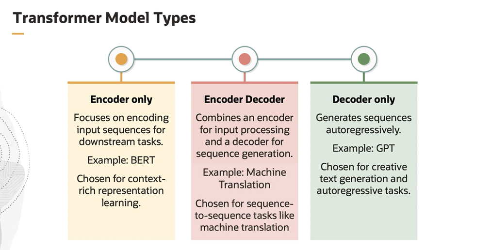
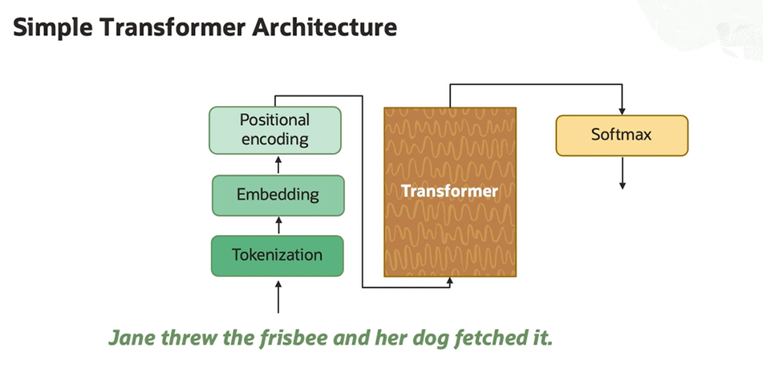

# Transformer Walkthrough

The transformer architecture is designed to handle sequential data, such as sentences, in natural language by using a mechanism called **self-attention**.

The self-attention mechanism allows the model to weigh the importance of words, or tokens, within a sequence with respect to each other, enabling the model to focus on relevant context, regardless of the distance between tokens. 

Transformer architecture eliminates the need for recurrent or convolutional layers that were common in previous sequence modeling architectures, such as RNNs and LSTMs. 

## Encoder Decoder

Transformer models have two main parts:

- Encoder
- Decoder 

Both parts are made up of layers and each layer has its own attention mechanism:
- the encoder reads the input sentence, for example, a sentence in English, and uses the attention mechanism to create a new representation of the sentence that captures the meaning of the words and their connections
- the decoder then uses this information to generate output sentence, for example, a translation of the input sentence in English into French using its own attention mechanism

## Transformer Model Types

Each architecture type is chosen based on the specific requirements of the task, whether it involves understanding context, generating sequences, or both.

## Simple Transformer Architecture

 The simple transformer architecture involves:

 1. **Tokenization**
    - it involves breaking down the sentence into smaller pieces called **tokens**
    - tokens can be short as one character or as long as one word
    - the choice of how to break down the sentence depends on the specific tokenizer used. 
 2. **Embedding**
    - each token is converted into a numerical form called **vector** that the model can understand
    - these vectors are created in a way that captures the meaning of the word
    - words that have similar meanings will have similar vectors (e.g. "dog" and a "canine")
 3. **Positional Encoding**
    - the model needs to know the order of the words in the sentence because the meaning of a sentence can change depending on the order of its words
    - the model adds information about the position of each word in the sentence to their corresponding vectors
 4. **Transformer**
    - each transformer block is made up of two parts: an **attention** and a **feed forward**
    - the attention part helps the model understand the context of each word
    - the feed forward part applies a specific function, known as the feed forward function, to each word individually
 5. **Softmax**
    - the model generates a list of scores for each word in the vocabulary
    - the model uses the softmax function to turn these scores into a probability distribution
    - these steps are then repeated for each word in the sentence
    
    

