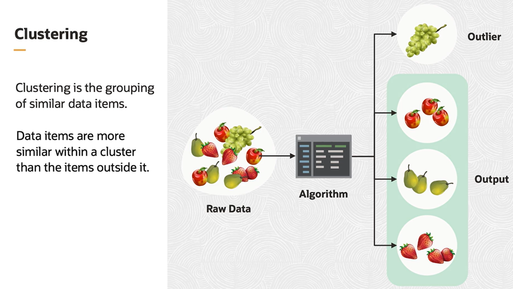
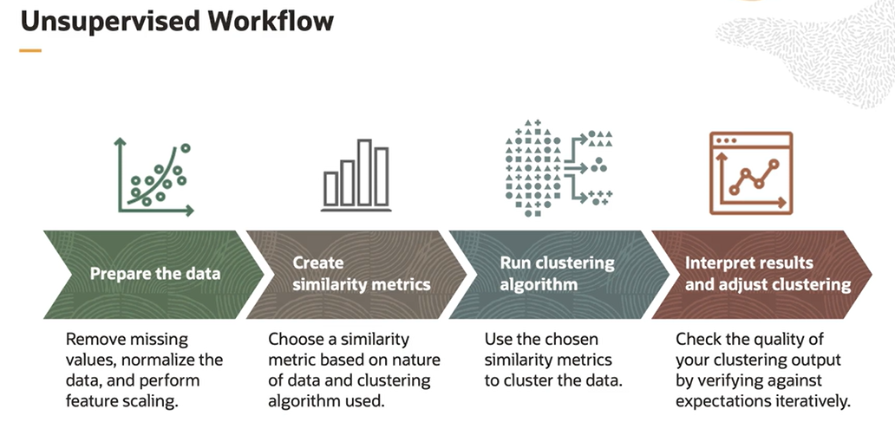

# Unsupervised Learning

Unsupervised machine learning is a type of machine learning where there are no labeled outputs. The algorithm learns the patterns and relationships in the data and groups similar data items. In unsupervised machine learning, the patterns in the data are explored explicitly without being told what to look.

## Clustering

Clustering is a method of grouping data items based on similarities. Within a cluster, the data items are more similar than the items outside the cluster. If some data items do not fall within any cluster, these data items are deemed as **outlier points**.

Similarity is how close two data points are to each other and is a value between 0 and 1. Similarity between objects decide which cluster they will fall into, and hence, important for clustering. 

## Unsupervised Workflow

1. Prepare the data
2. Create similarity metrics
3. Run clustering algorythm
4. Interpret results and adjust clustering

 ## Use Cases

- Market segmentation
- Outlier Analysis
- Recommendation Systems

